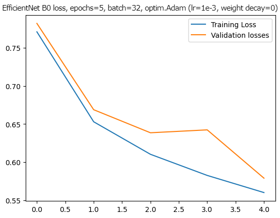
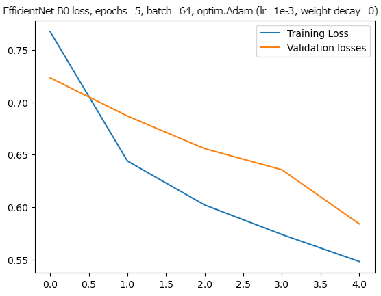
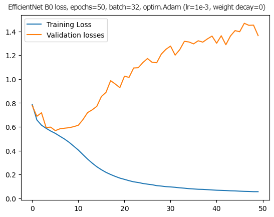
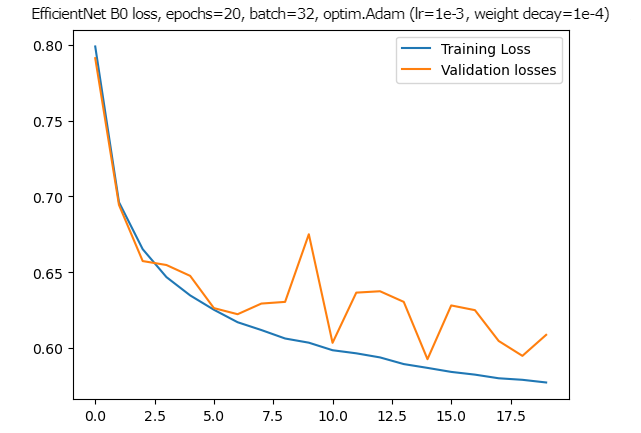

# Image-Based Chess Engine
 An experiement to see how well a chess engine trained purely on images would perform. 
 
 So far, the engine will only consider if the position is "good", "bad" or "neutral" from white's perspective, assuming it is white to play. Training images were sourced from the Lichess open data base for July 2022. For the sake of training, a "good" and "bad" position were those evaluated to be at least 1.5 in white/black's favor in the database (and hence "neutral" being inbetween). 

Why did I do this? In the wise words of Cave Johnson: 

<b>

&nbsp;&nbsp;&nbsp;&nbsp;&nbsp;&nbsp;"Science isn't about WHY. It's about WHY NOT."

</b>
 # Testing the models
 To try out a model, simply run the chessEngine/modelInteractive.py file and follow the prompts
 # Results so far
 Here are plots of the models I've trained. The goal of the project was just to see if this even slightly works, so decisions regarding hyperparameters and types of models were somehwat arbitrary (you can view these images in the chessEngine/results folder). 

 **Neural networks** 
 
    
    

 ***TODO:*** try using an SVM instead?
