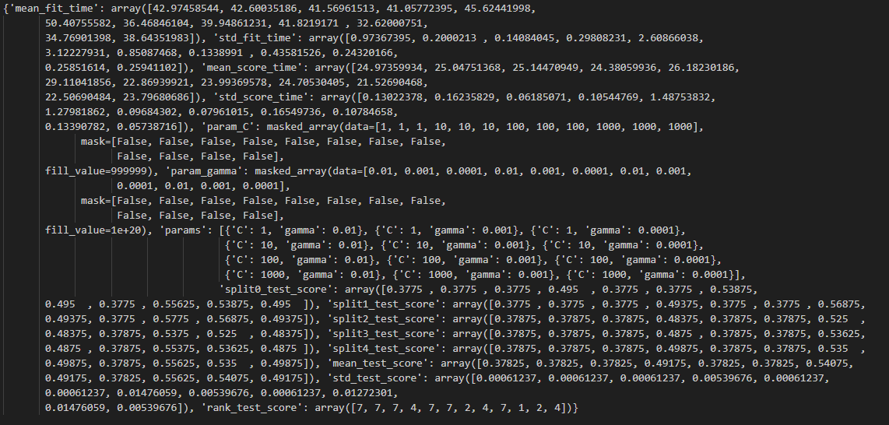

# Image-Based Chess Engine
 An experiement to see how well a chess engine trained purely on images would perform. 
 
 So far, the engine will only consider if the position is "good", "bad" or "neutral" from white's perspective, assuming it is white to play. Training images were sourced from the Lichess open data base for July 2022. For the sake of training, a "good" and "bad" position were those evaluated to be at least 1.5 in white/black's favor in the database (and hence "neutral" being inbetween). 

Why did I do this? In the wise words of Cave Johnson: 

<b>

&nbsp;&nbsp;&nbsp;&nbsp;&nbsp;&nbsp;"Science isn't about WHY. It's about WHY NOT."

</b>

# Testing the models
 ***!!!IMPORTANT!!!*** This project was built on Windows 10 using Python 3.10.14 since there's at least one package in here that is fine up to Python 3.10, so I'm not sure if the dependencies all work out for other platforms.  
 Additionally, this project uses the svglib package. I had to install svglib 1.0.1 to get the conversion process between SVG and PNG files working, so that could be a potential fix if it's not working for you.  
 
 To try out a model, simply run the chessEngine/modelInteractive.py file and follow the prompts.

 ***TODO:*** Add support to run SVM models  
# Results so far
 Here are plots of the models I've trained. The goal of the project was just to see if this even slightly works, so decisions regarding hyperparameters and types of models were somehwat arbitrary (you can view these images in the chessEngine/results folder). 

 **Neural networks** 
 
    
    
 

 **SVMs** 
 These first set of results are using 5000 randomly shuffled images from the dataset on different SVCs (sklearn)
  
 I then decided to train/test an svc using c=1000 and gamma=0.01 on 20000 images and got an accuracy of 0.60575  
 Next I tried using a LinearSVC due to its better runtime and from here on out I'll be using a lot more images.
 First was training/testing a LinearSVC using the default parameters on 20000 images. This got an accuracy of 0.59275.  
 I then tried another model (with 20k images) with C=1000, which got an accuracy of 0.68425. Running it over the rest of the dataset gives an accuracy of 0.681353  
 
